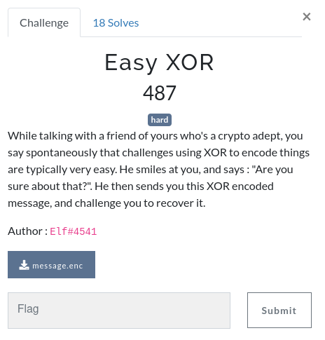
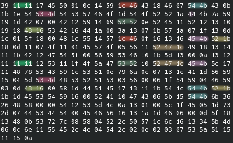

# Easy XOR



File: [message.enc](./xor.enc)

## The file

We are given a small plain text file that contains a base64 encoded string of ~400 characters.

```
ORERF0VQAQwUWRxGQxhGB1RLQwsbHlRTTVRTV0ZPHVRPUlIaREt6WRkdQgcAQhJZFGlTUg5SRRFSEhMQGRhDFlNCFkQaADoTBxtXGgcfEw0cAV8YAEgcVRRXHEYPFhMWRUtSGxgNEQdPEQFFV08FVhFSRxxJGBMUERtCEkdUXwBWWVNGEBtdEwAKExIRERESUxEfT1pHU1IQUkccRUtcFxFIeFNDWRxTUQ55agwHExxBHVZZFQRdU01IU1JRUwNWAAYfVFkERlkDDUMWAFgdRFFFFxMRG1QcVEtSGxsdRVNUWRYAUkEQR0MGWxVUS2s2JkhYAABUElNdTAoTAQBcH0UFHXMtB0RTRFQARUZWFhMaHUYGAA1fGBNIC1NyfAhYBFIsUFccbBYTNFtNBgxuEVVFLE4EVCwCDgIDB1NaURURFQ==
```

We are dealing with a XOR challenge. If it's not too weird, we can assume that our goal is to decrypt the base64 decoded binary data.

## A small observation

Before decoding the base64 string and working with the binary data, you might have noticed something. It's definitely not required for this challenge to know that, but the base64 string looks kinda "off" if you are used to dealing with such strings.

What catches the eye is that there are a lot more uppercase characters (~300) than lowercase ones (~100). This means that there is a bias in the binary data as random data would not exhibit such a big difference, and the XOR encryption cannot be the only reason for that.

## Analyzing the data

Ok, now let's decode the base64 string and see what we are working with.

```
$ cat message.enc | base64 -d | xxd
00000000: 3911 1117 4550 010c 1459 1c46 4318 4607  9...EP...Y.FC.F.
00000010: 544b 430b 1b1e 5453 4d54 5357 464f 1d54  TKC...TSMTSWFO.T
00000020: 4f52 521a 444b 7a59 191d 4207 0042 1259  ORR.DKzY..B..B.Y
00000030: 1469 5352 0e52 4511 5212 1310 1918 4316  .iSR.RE.R.....C.
00000040: 5342 1644 1a00 3a13 071b 571a 071f 130d  SB.D..:...W.....
00000050: 1c01 5f18 0048 1c55 1457 1c46 0f16 1316  .._..H.U.W.F....
00000060: 454b 521b 180d 1107 4f11 0145 574f 0556  EKR.....O..EWO.V
00000070: 1152 471c 4918 1314 111b 4212 4754 5f00  .RG.I.....B.GT_.
00000080: 5659 5346 101b 5d13 000a 1312 1111 1112  VYSF..].........
00000090: 5311 1f4f 5a47 5352 1052 471c 454b 5c17  S..OZGSR.RG.EK\.
000000a0: 1148 7853 4359 1c53 510e 796a 0c07 131c  .HxSCY.SQ.yj....
000000b0: 411d 5659 1504 5d53 4d48 5352 5153 0356  A.VY..]SMHSRQS.V
000000c0: 0006 1f54 5904 4659 030d 4316 0058 1d44  ...TY.FY..C..X.D
000000d0: 5145 1713 111b 541c 544b 521b 1b1d 4553  QE....T.TKR...ES
000000e0: 5459 1600 5241 1047 4306 5b15 544b 6b36  TY..RA.GC.[.TKk6
000000f0: 2648 5800 0054 1253 5d4c 0a13 0100 5c1f  &HX..T.S]L....\.
00000100: 4505 1d73 2d07 4453 4454 0045 4656 1613  E..s-.DSDT.EFV..
00000110: 1a1d 4606 000d 5f18 1348 0b53 727c 0858  ..F..._..H.Sr|.X
00000120: 0452 2c50 571c 6c16 1334 5b4d 060c 6e11  .R,PW.l..4[M..n.
00000130: 5545 2c4e 0454 2c02 0e02 0307 535a 5115  UE,N.T,.....SZQ.
00000140: 1115 0a
```

Well, this is why the base64 string was weird, every byte in the encrypted data is less than 128 ! This is not usual for a XOR encryption. What can we infer from this ?

The most reasonable explanation here is :
- The plaintext is ASCII < 128 only, because it's a text written in human language.
- The key used for XOR encryption is ASCII < 128 only for the same reason.

Indeed, if both those statements are correct, the first bit of all the bytes in the plaintext and the key are 0 and that makes it the same for all encrypted bytes.

## Finding the key length

The first thing we have to do is find the length of the key used for the XOR encryption. How can we do this ?

The data is long enough that we can try to find equal sequences of bytes in the encrypted text. This is not a foolproof method but it works here.

If we find two equal sequence of N bytes, there is a good chance these sequences are equal in the plaintext AND the same part of the key was used to encrypt both sequences (= the distance between the two sequences is a multiple of the key length).

For example, if we encrypt `ABCDEF ABCDYZ` with the key `xumxzyv`, we get `97.<??V97.<##`. Here we find `97.<` twice because the string `ABCD` is repeated in the plaintext and the distance between both strings is the key length.

We could achieve this with some intelligent programming but that requires thinking too much, when we can simply exploit our brain and its pattern recognition.

Aligning the data by blocks of 20 bytes gives us the best results (and 10 looks worse), so we can safely infer that the key length is most likely 20 and that our previous assumptions are correct.



## Choosing a strategy

There are tons of more or less complex methods to retrieve the key here. The most robust methods in our case (human language plaintext) might use some kind of statistical analysis to detect frequent bigrams / trigrams of letters in the language used and generate probable parts of the key from that.

Gradient descent could also be used to find a key that optimize properties of the plaintext (letters repartition, bigrams, etc.).

I didn't want to think too hard on that so after a few failed attempts, I settled for a not too complex strategy that combines:
1. Finding the only characters in each position of the key that generates a subset of printable ASCII characters in the decrypted text.
3. Guessing a part of the key from those characters.
2. Guessing parts of the plaintext (= cribs) to retrieve the rest of the key.

## Finding good characters for the key

To start, we need to choose one charset for the key and one charset for the plaintext. From that we will find the only possible characters in each position of the key that decrypt the data to the chosen charset.

First let's choose a charset for the plaintext. We know from our previous assumptions that it is ASCII < 127. Assuming it's readable text, we can start with a `[A-Za-z0-9 ]` charset and add probable special characters like ponctuation, spaces and `{}_-` (for the flag) until we reach a good result.

For the key, since it's only 20 characters long and we assume it's readable, `[A-Za-z0-9 ]` + a few characters like `{} -_` should probably be enough. If it's not we can still add more later.

Now for each position in the key, we can generate the list of characters that decrypt to our plaintext charset.

```python
import base64
import string
enc = open("message.enc", "rb").read()
enc = base64.b64decode(enc)

key_len = 20
plain_charset = string.ascii_letters + string.digits + " .,?!{}_-'\":;%\n"
key_charset = string.ascii_letters + string.digits + " -_{}"

for i in range(key_len):
    candidates = [] # The valid candidates for key[i]
    subset = enc[i::key_len] # Subset of characters from the encrypted data that are encrypted with key[i]
    for c in key_charset:
        total_in_charset = sum(1 for d in subset if chr(ord(c) ^ d) in plain_charset)
        if total_in_charset == len(subset):
            candidates.append(c)
    print(f"key[{i}]:", candidates)
```

As a result we get the following:

```
key[0]: ['a', 'h', 'r', 't', 'w', 'P', 'T', 'V', 'W']
key[1]: ['h', 'w']
key[2]: ['1']
key[3]: ['a', 'b', 'c', 'e', 's', 't', ' ', '}']
key[4]: ['6', '7', ' ']
key[5]: ['1', '3']
key[6]: ['d', 'e', 'f', 'g', 'k', 's']
key[7]: ['4', '6', ' ']
key[8]: ['4']
key[9]: [' ']
key[10]: ['s']
key[11]: ['3', ' ']
key[12]: ['b', 'c', 'u', 'v', 'w']
key[13]: ['k', 'm', 'p', 'r', 's', 'u', 'w']
key[14]: ['3']
key[15]: ['t']
key[16]: ['1', ' ']
key[17]: ['k']
key[18]: ['3']
key[19]: ['y']
```

This looks pretty good ! We can already guess the second half of the key is `s3cr3t k3y`.

## Finding the rest of the key

Now that we have half of the key, the rest of the strategy is pretty straightforward. First we decrypt the part of the text that is encrypted with this part of the key.

```
**********ou just pr**********ng, and I ********** am very i**********I didn't t**********ould be ab**********ver this m********** using a k********** as the on**********
You have **********pect, you **********d right ab**********ct that XO**********y broken.
**********e your fla**********_c4n_b3_h4**********_1mp0ss1bl**
```

Then we guess some cribs in the plaintext to recover other characters of the key. In this case, we find `XOR`, `flag` and `1mp0ss1ble}`.

We repeat this strategy of finding cribs and updating the key until we have retrieved all the plaintext.

```
th1s 1s 4 s3cr3t k3y

My dear, you just prove me wrong, and I must say I am very impressed. I didn't think you would be able to recover this message, by using a key as long as the one I chose.
You have all my respect, you were indeed right about the fact that XOR is easily broken.
You deserve your flag : RM{x0r_c4n_b3_h4rd_but_n0t_1mp0ss1ble}
```

You can find the source code including these last steps [here](./exploit.py).