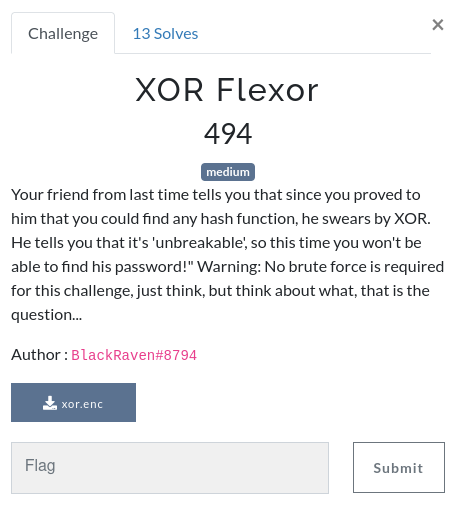

# XOR Flexor



File: [xor.enc](./xor.enc)

## The file

We are given a small plain text file that contains what looks like an array of 32 characters (all included in a 0-255 ASCII table).

```
['þ', 'Ã', 'E', '\x97', '\x9f', 'ü', 'G', '\x9e', 'ÿ', '½', ']', '´', 'Þ', '½', 'a', '\x87', 'à', 'º', 'Y', '\x9e', '\x9f', 'à', ']', '³', 'Õ', 'þ', 'J', 'ñ', 'Þ', '¯', '\x1f', '¼']
```

The challenge and file names indicate that this is probably an array of 32 characters that were encrypted using a XOR cipher. If we want to find the flag we will have to decrypt these characters.

## Intuition

Assuming the byte array is our encrypted text, we have only 32 characters to work with. That is definitevely not enough for any kind of statistical analysis and the challenge description tells us that there is no bruteforce required so we are not left with many solutions...

One of them is the Known-Plaintext Attack, maybe we can guess a part of the plaintext?

The plaintext will be 32 characters long so it could simply be the flag. And we know that all flags during this CTF are formatted in the same way: `RM{...}`.

## Decryption

Since we guessed four characters of the plaintext and there is no bruteforce required, let's try to decrypt with a four characters key.

Hint to retrieve the key: 

```
plain[i] ^ key[i] = enc[i]
A ^ A is always 0

-> key[i] = plain[i] ^ enc[i]
```

Let's make a simple script (we can directly copy paste the array in python =D).

```python
#!/usr/bin/python3

enc = ['þ', 'Ã', 'E', '\x97', '\x9f', 'ü', 'G', '\x9e', 'ÿ', '½', ']', '´', 'Þ', '½', 'a', '\x87', 'à', 'º', 'Y', '\x9e', '\x9f', 'à', ']', '³', 'Õ', 'þ', 'J', 'ñ', 'Þ', '¯', '\x1f', '¼']
cipher_len = len(enc)
key_len = 4

key = [0, 0, 0, 0]
key[0] = ord('R') ^ ord(enc[0])
key[1] = ord('M') ^ ord(enc[1])
key[2] = ord('{') ^ ord(enc[2])
key[(cipher_len - 1) % key_len] = ord('}') ^ ord(enc[-1])

plain = "".join(chr(key[i % key_len] ^ ord(c)) for i, c in enumerate(enc))
print(plain)
```

Our intuition was correct!
```
RM{V3ry_S3cur3_FL4g_3ncrypt0r!!}
```