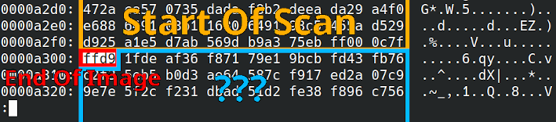

# Rechatdrage

File: [rechatdrage.jpg](./rechatdrage.jpg)

## Some context

Rechatdrage is misc challenge rated 2 out of 3 stars in difficulty. The description explains that we were sent a cat picture on Discord that was cropped beforehand. The goal is to find a way to "uncrop" the image to find the flag inside it.

This challenge is very reminiscent of a recent vulnerability, the [CVE-2023-21036](https://nvd.nist.gov/vuln/detail/cve-2023-21036) also known as ["aCropalypse"](https://en.wikipedia.org/wiki/ACropalypse). A failure to truncate a PNG image file after it is cropped could allow attackers to recover the cropped part of the image. This vulnerability affected the Markup screenshot tool for Google Pixel phones, and a similar vulnerability was later found in Windows 10 / 11 Snipping tool.

Can we go full script-kiddy for this challenge? Well no, we are given a JPEG file, not a PNG file so the [online proof of concept for acropalypse](https://acropalypse.app/) will not help us. We will need to understand some parts of the JPEG format specification to solve this.

## JPEG partitioning

A good start to understand how JPEG image start is the [Syntax and structure paragraph](https://en.wikipedia.org/wiki/JPEG#Syntax_and_structure) on the Wikipedia page for JPEG.

> A JPEG image consists of a sequence of segments, each beginning with a marker, **each of which begins with a 0xFF byte**, followed by a byte indicating what kind of marker it is. 

> Within the entropy-coded data, after any 0xFF byte, a 0x00 byte is inserted by the encoder before the next byte, so that there does not appear to be a marker where none is intended

With this information, let's open the JPEG file in an hexadecimal editor, find the `0xff` bytes not followed by `0x00` and check what kind of segments are used and what we can do with them. More in-depth information about the segments can be found on the web, I found [this random 2002 webpage](https://mykb.cipindanci.com/archive/SuperKB/1294/JPEG%20File%20Layout%20and%20Format.htm) to be good enough for what we want to do.

First we can look at the start of the file :

We find data we should expect from a JPEG file :
- The APP0 JFIF segment marker confirms that this is an image file in JPEG File Interchange Format.
- Two Define Quantization Table (DQT) segments contain two 8x8 matrices of coefficients used by the JPEG encoding algorithm. It's not very important to understand exactly how this process works but you can find some info in [this forum post](https://forum.doom9.org/showthread.php?t=54147&highlight=matrix).
- The Start Of Frame (SOF) segment contains metadata about the image like its width, height and and number of color components.
- Four Define Huffman Table (DHF) segments contain huffman codes symbols that were used to compress the image data with [Huffman coding](https://en.wikipedia.org/wiki/Huffman_coding).
- The very large Start Of Scan (SOS) segment contains the actual compressed image data.

Now if we go all the way to the end of the Start Of Scan segment, this is what we find :

The End Of Image (EOI) segment at the end of Start Of Scan signals the end of the image data. Any image editing tool will stop parsing the image data when reaching this segment and there should not be anything after it, especially not data not starting with a `0xff` marker.

From the challenge context, we understand that the data after EOI is probably leftover data from the original uncropped image. To confirm this hypothesis, we can check the very end of the file and find that there is indeed another End Of Image marker. This one belongs to the original JPEG file.

Our goal here is to find a way to render this data correctly.

## Updating the image dimensions

The first thing we can do to try to display the rest of the image is to update the image width and height in the image metadata. This information can be found in the Start Of Frame segment which contains the following data :
- `0xffc0` : Start Of Frame marker
- `0x0011` : Length of the segment
- `0x08` : Data precision in bits/sample
- `0x00dd` : **Image height**
- `0x016a` : **Image width**
- Some data about image color components and which Quantization Tables to use for each component.

Let's start by setting the image height to something larger and see if it does anything.

...that wasn't very effective.

What's the issue here? As we explained, the first End Of Image encountered will make any image viewer stop parsing the image data. What we can try then is to also replace the `0xffd9` marker by something else like `0x55d9` so that the image data parsing does not stop before the end of the file.

We are now able to display data that was not visible in the cropped image! The color is not very good and the width looks incorrect but that's a start.

Before taking care of the color, let's update the width of the image so that it matches the original uncropped image and renders correctly. This is what we get with a `0x03dd` height and `0x04aa` width :

And that was enough to get the flag.

## Getting better colors

We could stop here but maybe we can try to get better colors to see this beautiful cat in his natural habitat.

Not going too much into details, a consequence of using the Huffman coding for data compression is that any error such as a wrong bit can propagate to the rest of the decompressed data. This is kind of what we see here with the entire image having a weird color when we only modified one byte of data.

A simple way to get better colors is to try different values for the byte that replaces the End Of Image marker and use the best one.

Not perfect but a lot better!
