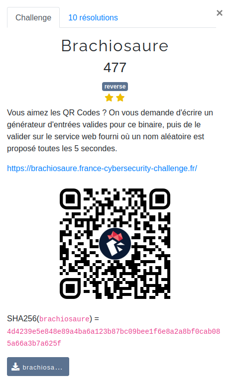
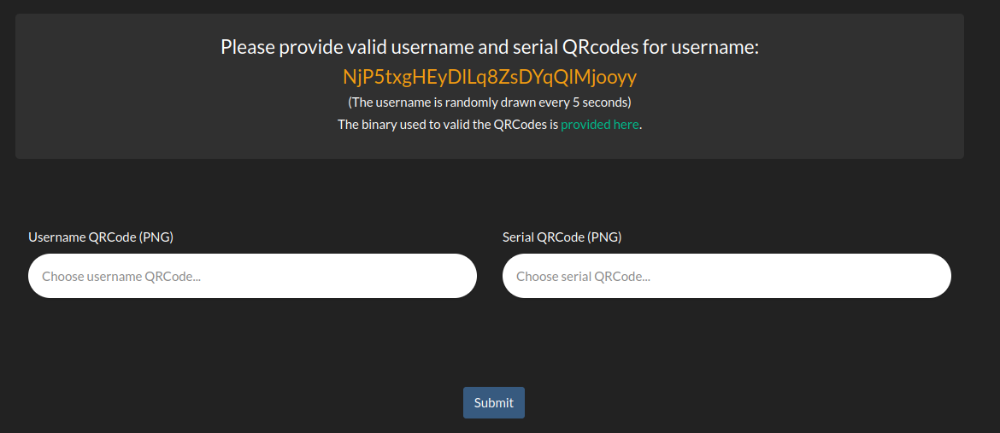
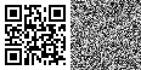
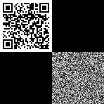
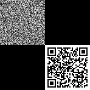

# Brachiosaure



File: [brachiosaure](./brachiosaure)

## Understanding the challenge

Brachiosaure is a reverse engineering challenge rated 2 out of 3 stars in difficulty. As explained in the challenge description, a web service generates a random username every 5 seconds and the goals is to find valid inputs associated to this username for the given binary file.



The web service expects two PNG images associated with the username: a **Username QRCode** and **Serial QRCode**.

The first step of this challenge is to reverse engineer the provided executable and find out what it wants from us. A quick look with `file` and `ldd` shows that it is in `ELF x86-64` format and that it is using many shared libraries. Some of them are used for images processing, and we can also find [the zbar library](https://github.com/herbyme/zbar) used for reading QR codes from images.

```console
$ file ./brachiosaure 
./brachiosaure: ELF 64-bit LSB pie executable, x86-64, version 1 (SYSV), dynamically linked, [...], stripped

$ ldd ./brachiosaure 
    libzbar.so.0 => /usr/lib/libzbar.so.0 (0x00007f411a376000)
    libpng16.so.16 => /usr/lib/libpng16.so.16 (0x00007f411a33d000)
    libcrypto.so.1.1 => /usr/lib/libcrypto.so.1.1 (0x00007f411a05d000)
    libc.so.6 => /usr/lib/libc.so.6 (0x00007f4119e76000)
[...]
```

Running the binary with no arguments shows the usage, which confirms that we need to find two valid images for a specific username.

```console
$ ./brachiosaure 
Usage: ./brachiosaure <username> <username.png> <serial.png>
```

## Loading up the decompiler

I used `ghidra` to reverse engineer the executable statically and `gdb` to debug and confirm some hypotheses when testing various inputs. The file is not too big and contains only a few functions, but it is stripped, so we will have to find out the role of variables without their names.

Skipping ahead after some cleaning and renaming, this is what the main function looks like :

```C
int main(int argc, char** argv) {
  int first_png_width = 0;
  int first_png_height = 0;
  void* first_png_data = NULL;
  void* first_png_zbar_image = NULL;
  int second_png_width = 0;
  int second_png_height = 0;
  void* second_png_data = NULL;
  void* second_png_zbar_image = NULL;
  char username_hash[64];
  SHA512_CTX sha256_ctx;
  /* Arguments count should be 3 (username + two images) */
  if (argc != 4) {
    printf("Usage: %s <username> <username.png> <serial.png>\n",*argv);
    exit(1);
  }
  /* Compute sha256(username) */
  strcpy(username_hash, argv[1]);
  SHA512_Init(&sha256_ctx);
  SHA512_Update(&sha256_ctx, username_hash, strlen(argv[1]));
  SHA512_Final(username_hash, &sha256_ctx);
  /* Load both images and read their QR code */
  int first_ok = load_QR_code(argv[2], &first_png_data, &first_png_width, &first_png_height,
                        &first_png_zbar_image, first_png_symbol_data, 0x40);
  int second_ok = load_QR_code(argv[3], &second_png_data, &second_png_width, &second_png_height,
                        &second_png_zbar_image, second_png_symbol_data, 0x40);
  /* The images should both contain a QR code */
  if (first_ok == 0 || second_ok == 0) {
    exit(1);
  }
  /* First QR code should be sha256(username) */
  int fail0 = memcmp(username_hash, first_png_symbol_data,0x40) != 0;
  /* Both images should have the same size */
  int fail1 = second_png_width != first_png_width;
  int fail2 = second_png_height != first_png_height;
  /* Both images should be squares */
  int fail3 = first_png_width != first_png_height;
  /* ??? Check some stuff with maths ??? */
  void* some_data = NULL;
  bool res1 = some_computation1(first_png_symbol_data, second_png_symbol_data, 8);
  int res2 = some_computation2(first_png_data, second_png_data, &some_data, first_png_width);
  /* Set error status */
  int status = fail0 || fail1 || fail2 || fail3 || (res1 == 0) || (res2 == 0);
  /* Cleanup and exit */
  free(first_png_data);
  free(second_png_data);
  free(some_data);
  exit(status);
}
```

The function `load_QR_code` looks the most complicated, but it's actually just loading the images and reading the codes. In a few words, it uses the `libpng` library to load a PNG image and convert it to shades of gray. The resulting encoding is **one byte per pixel between 0 for black and 255 for white**. It then tries to read the QR code data in the image using the `libzbar` library. Finally, it returns the image pixels data, width, height, and QR code decoded data as arguments and also returns 1 if a QR code was loaded correctly.

It's better not to spend more time on trying to find issues in this image loading step and focus on the rest of the main function instead. Once both images and their QR codes are loaded, a few simple verifications are performed :
- The images should both contain a valid QR code.
- The first decoded QR code should be the sha256 of the username.
- Both images should be squares.
- Both images should have the same size.

Finally, two additional computations are made which look a bit more complicated.
- Function `some_computation1` uses the QR code decoded data from both images, it should return `true`.
- Function `some_computation2` uses the pixel data from both images and their width, it should also return `true`.

## some_computation1 : sounds easy

The first function is very short and doesn't look too bad.

```C
bool some_computation1(char* first_png_symbol, char* second_png_symbol, int size) {
  if (first_png_symbol == NULL || second_png_symbol == NULL) {
    return false;
  }
  char *buf;
  some_computation2(first_png_symbol, first_png_symbol, out, eight);
  bool res = memcmp(second_png_symbol, &buf, size * size) == 0;
  free(buf);
  return res;
}
```

All it does is call the second computation function with the first image QR code data twice and check that the second QR code contains the result of that function.

## some_computation2 : oh no is it math?

Let's first look at the second computation function. Here is the original experience when you open it in ghidra for the first time. 

```C
bool some_computation2(char *data_1,char *data_2,void **out,int size) {
  char cVar1;
  long lVar2;
  void *pvVar3;
  char cVar4;
  long lVar5;
  int iVar6;
  long lVar7;
  bool bVar8;
  long lVar9;
  char *pcVar10;
  if (data_1 == (char *)0x0) {
    return false;
  }
  bVar8 = false;
  if (data_2 != (char *)0x0) {
    pvVar3 = calloc((long)(size * size),1);
    lVar7 = 0;
    *out = pvVar3;
    bVar8 = true;
    for (iVar6 = 0; iVar6 < size; iVar6 = iVar6 + 1) {
      lVar5 = 0;
      do {
        pcVar10 = data_2 + lVar5;
        lVar9 = 0;
        cVar4 = '\0';
        do {
          lVar2 = lVar9 + lVar7;
          cVar1 = *pcVar10;
          lVar9 = lVar9 + 1;
          pcVar10 = pcVar10 + size;
          cVar4 = cVar4 + data_1[lVar2] * cVar1;
        } while ((int)lVar9 < size);
        *(char *)((long)*out + lVar5 + lVar7) = cVar4;
        if (iVar6 == (int)lVar5) {
          cVar4 = cVar4 + -1;
        }
        lVar5 = lVar5 + 1;
        bVar8 = (bool)(bVar8 & cVar4 == '\0');
      } while ((int)lVar5 < size);
      lVar7 = lVar7 + size;
    }
  }
  return bVar8;
}
```

Ugh... Multiplications, sums, parallel iteration over two arrays... Is it going to be another crypto challenge disguised as reverse? It took me some time to recognize what it does, but it's actually not that bad, no crypto involved.

Spoiling it now: this function **calculates the dot product of two square matrices**. Since we are working with bytes, all operations are made **modulo 256**. The result is written in the third parameter. Additionally, the function returns `true` if all the values in the result matrix are 0, except the ones on the main diagonal which should all be 1. That's the identity matrix. 

Rewording this last bit, the function returns `true` if the first matrix is the inverse of the second one.

## Summing up the problem

The reverse engineering part is over, and we can now reformulate the problem.

For a given username, the program will exit correctly if the following conditions are met :

1. Both PNG images are squares of the same size.
2. The first image contains a QR code encoding the sha256 digest of the username.
3. The second image should also contain a QR code
4. When representing the QR codes data as 8x8 matrices, the second matrix should be the square of the first one (working modulo 256).

So far this is quite easy, but the last condition is where things spice up a bit.

5. When representing both PNG images as width*width matrices of pixels, the first matrix should be the inverse of the second one (working modulo 256).

At first the problem looks hard: **how can we ensure that both images are QR codes, but also that the images pixel matrices are the inverse of each other?!**

For reference, here is a random QR code and the image generated when calculating the inverse of the QR code image.



## The block matrix trick

Thinking about this problem for some time, I finally came to an important realization that is the key for the method I used.

**The QR code doesn't have to take up the entire image!**

It may sound obvious, but you first have to realize that there is no check on the image sizes. To make the problem a lot harder, the author could have forced the size of the images to be something like 50 so that the QR code have to take the most part of the image.

Knowing that, a method to solve this problem is to use **block matrices**. A block matrix is simply a matrix broken into smaller submatrices (called blocks). What's interesting with block matrices is that the dot product multiplication of block matrices works just the same as regular matrices.

To illustrate, if we split two big matrices $A$ and $B$ into smaller matrices $A_{1,1}, A_{1,2}, A_{2,1}, A_{2,2}$ and $B_{1,1}, B_{1,2}, B_{2,1}, B_{2,2}$, the dot product of $A$ and $B$ can be computed this way :

```math
A \cdot B =
\begin{pmatrix}
A_{1,1} & A_{1,2} \\
A_{2,1} & A_{2,2}
\end{pmatrix}
\cdot 
\begin{pmatrix}
B_{1,1} & B_{1,2} \\
B_{2,1} & B_{2,2}
\end{pmatrix}
=
\begin{pmatrix}
A_{1,1} \cdot B_{1,1} + A_{1,2} \cdot B_{2,1} & A_{1,1} \cdot B_{1,2} + A_{1,2} \cdot B_{2,2}\\
A_{2,1} \cdot B_{1,1} + A_{2,2} \cdot B_{2,1} & A_{2,1} \cdot B_{1,2} + A_{2,2} \cdot B_{2,2}
\end{pmatrix}
```

In particular, by choosing $A_{1,2} = A_{2,1} = B_{1,2} = B_{2,1} = 0$, we get :

```math
A \cdot B =
\begin{pmatrix}
A_{1,1} & 0 \\
0 & A_{2,2}
\end{pmatrix}
\cdot 
\begin{pmatrix}
B_{1,1} & 0 \\
0 & B_{2,2}
\end{pmatrix}
=
\begin{pmatrix}
A_{1,1} \cdot B_{1,1} & 0\\
0 & A_{2,2} \cdot B_{2,2}
\end{pmatrix}
```

Finally, by choosing $B_{1,1} = A_{1,1}^{-1}$ and $A_{2,2} = B_{2,2}^{-1}$, we reach the following equality (where $I$ is the identity matrix) :

```math
A \cdot B =
\begin{pmatrix}
A_{1,1} & 0 \\
0 & B^{-1}_{2,2}
\end{pmatrix}
\cdot 
\begin{pmatrix}
A^{-1}_{1,1} & 0 \\
0 & B_{2,2}
\end{pmatrix}
=
\begin{pmatrix}
A_{1,1} \cdot A^{-1}_{1,1} & 0\\
0 & B^{-1}_{2,2} \cdot B_{2,2}
\end{pmatrix}
=
\begin{pmatrix}
I & 0 \\
0 & I
\end{pmatrix}
=
I
```

Armed with this knowledge, we can now create the following two images / matrices which will satisfy all conditions.

```math
Image1 = 
\begin{pmatrix}
QRcode1 & 0 \\
0 & inverse(QRcode2)
\end{pmatrix}
```

and

```math
Image2 =
\begin{pmatrix}
inverse(QRcode1) & 0 \\
0 & QRcode2
\end{pmatrix}
```

All that's left now is to code some Python and Sage scripts to generate the QR codes, invert some matrices, create the PNG images, and we should be done.

Easy? There are a few technicalities that we need to take care of first.

## Generating QR codes

To generate the two QR codes, I used [the qrcode Python library](https://pypi.org/project/qrcode/).

After some tweaking the parameters, I found a good compromise between image size and performances. A big image means inverting a bigger matrix which could take too much time as we only have 5 seconds to generate everything. A QR code too small was harder to detect by `libzbar`.

Adding a border also helped the library to correctly identify QR codes.

```python
# Use high correction % just in case to not break the codes
ERROR_CORRECT = qrcode.constants.ERROR_CORRECT_L
# Use a small box size to work with small matrices
BOX_SIZE = 2
# Use a border so that the QR codes are easier to find
BORDER = 2
# Generate a first QR code containing sha512(username)
data = hashlib.sha512(username).digest()
qr = qrcode.QRCode(version=1, error_correction=ERROR_CORRECT, box_size=BOX_SIZE, border=BORDER)
qr.add_data(data)
# Convert to shade of grey
qr1 = qr.make_image().convert("L")
```


## ZeroDivisionError: input matrix must be nonsingular

To inverse the QR code matrices, I first tried to use Python's `sympy` module, but for some reason it wasn't able to it in less than several minutes. This is apparently a [known performance issue](https://github.com/sympy/sympy/issues/23131). Instead, I resorted to using a SageMath script which usually does the job in less than a second.

```python
# Read 2 matrices from command line
M1 = Matrix(IntegerModRing(256), eval(sys.argv[1]))
M2 = Matrix(IntegerModRing(256), eval(sys.argv[2]))
# Invert and print them
print(M1.inverse())
print(M2.inverse())
```

Sadly, it fails with an error when trying to invert the matrices from the generated QR codes.

```console
Traceback (most recent call last):
  File "sage/matrix/matrix0.pyx", [...]
TypeError: matrix denominator not coprime to modulus

During handling of the above exception, another exception occurred:

Traceback (most recent call last):
  File [...]
ZeroDivisionError: input matrix must be nonsingular
```

Well it makes sense, not all matrices are invertible!

When working with coefficients in $\mathbb{R}$, a square matrix is invertible if and only if its determinant is non-zero. In this problem we are working with the ring of integers modulo 256. The condition for a matrix to be invertible here is that **its determinant is coprime with 256**, so the determinant has to be odd.

With default QR code matrices, the QR code border makes the determinant zero because we get multiple lines with the exact same pixel values.

Fortunately there is a solution that doesn't involve too much math, the "add random garbage" strategy. Once the image is generated, we can just **randomly modify the lower bits of every pixel** to ensure that no lines and columns are equal, then pray that the new matrix has an odd determinant. If that's not the case, we can just keep switching random bits in the image until it is. In practice, the determinant becomes odd after only 2-10 modifications. Calculating the probability to get an invertible matrix is left as an exercise.

```python
# === On the Python side ===

# Convert the qr code images to pixel matrices
# Add some random noise so that there is no equal lines and columns
# This way the matrice have a chance to be invertible
A = [[qr1.getpixel((x,y)) ^ random.randint(0, 7) for x in range(SIZE)] for y in range(SIZE)]
B = [[qr2.getpixel((x,y)) ^ random.randint(0, 7) for x in range(SIZE)] for y in range(SIZE)]


# === On the SageMath side ===

# Randomize M1 until it has an odd determinant so that it is invertible
while True:
    M1 = Matrix(IntegerModRing(256), m1)
    if M1.determinant() % 2 == 1:
        break
    m1[random.randint(0, size-1)][random.randint(0, size-1)] ^^= 1

# Randomize M2 until it has an odd determinant so that it is invertible
while True:
    M2 = Matrix(IntegerModRing(256), m2)
    if M2.determinant() % 2 == 1:
        break
    m2[random.randint(0, size-1)][random.randint(0, size-1)] ^^= 1
```

Note that this method works because `libzbar` is smart enough to be able to read QR codes that are not completely black and white. Modifying the lower bits of a pixel byte only slightly modifies the pixel color and the program is still able to extract the data correctly.

## Wrapping it up

Now that we are able to generate QR code and the inverse images, all that's left is generating the final images and send them to the web service to get the flag.

Here is what our final images look like for the username "K0iJjr6ApisouABCNW2FDPt5OwLLhcn".

The "username" QR code.



The "serial" QR code.



Wrapping everything in a Python script, we get the flag.

```console
$ python solve.py 
Username: K0iJjr6ApisouABCNW2FDPt5OwLLhcn
Generating images...
Images generation OK
Found valid images for username K0iJjr6ApisouABCNW2FDPt5OwLLhcn
Got the flag: FCSC{c2ddbd0310bcf5f65c576453ee9697774afd38dc887b64f4dccc63ac598d084b}
```

You can find the code for the automated solving process here :
- The main [Python keygen script](./scripts/keygen.py) used to generate valid images for a given username.
- The [SageMath script to adjust and inverse the QR code matrices](./scripts/adjust_and_inverse.sage).
- A [wrapper script](./scripts/solve.py) that solves the challenge and fetches the flag.